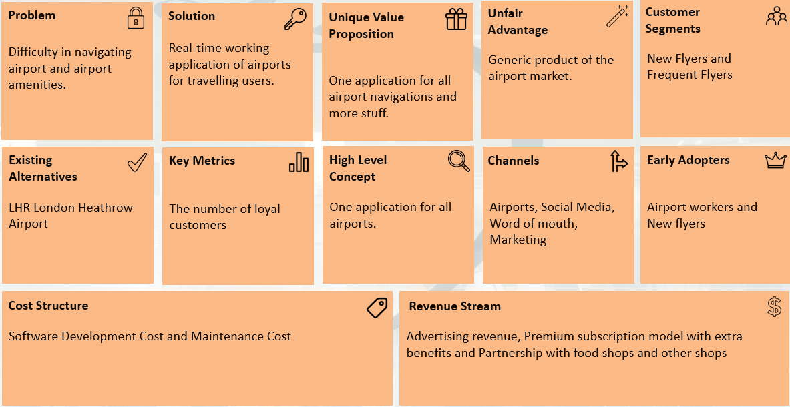
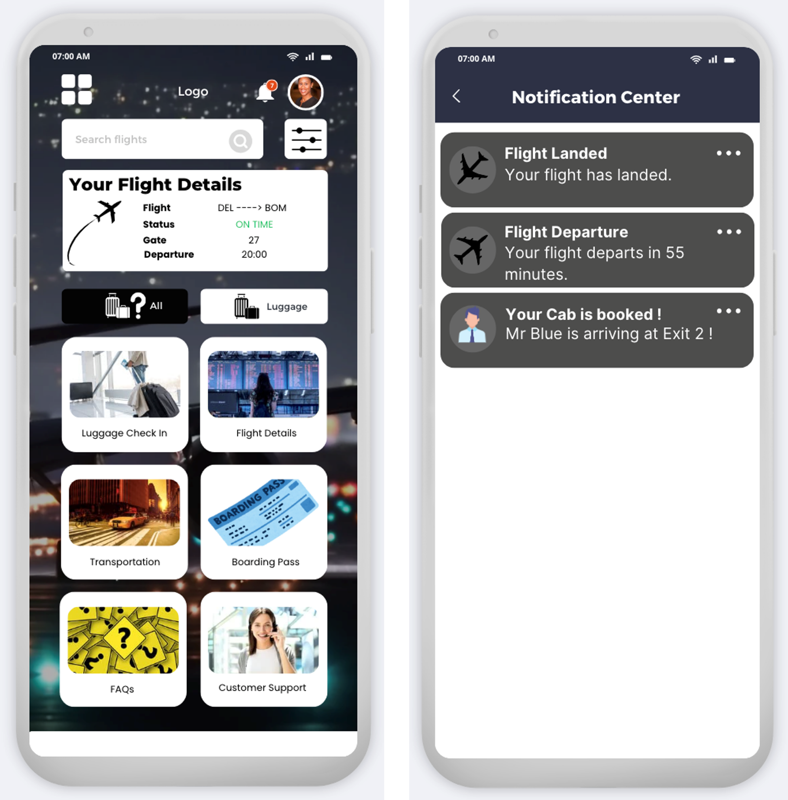

# AeroLink: A Product Management Case Study

[cite_start]**Product Vision:** To create a seamless, stress-free airport experience for all travelers by providing a single, intuitive mobile application for navigation, real-time information, and essential services. [cite: 15, 289]

---

### The Problem

Air travel is often a stressful experience, particularly within the airport itself. [cite_start]Through user interviews and market analysis, we identified several core pain points for both new and frequent flyers[cite: 312, 315, 318, 320]:

* [cite_start]**Navigation Anxiety:** Large, complex airport layouts are confusing and cause significant stress for travelers trying to find their gates, lounges, or amenities[cite: 275, 283].
* [cite_start]**Information Uncertainty:** Last-minute gate changes, flight delays, and inconsistent boarding time announcements create anxiety and can lead to missed flights[cite: 276, 284].
* [cite_start]**Baggage Worries:** The lack of visibility into the status and location of checked luggage is a primary source of concern, especially during tight connections[cite: 278, 285].
* [cite_start]**Accessibility Gaps:** Travelers with disabilities, language barriers, or special needs often lack the specific support required to navigate the airport independently[cite: 279, 287, 334].

### My Role

As a Product Manager on this academic project, I was responsible for driving the product discovery and strategy phases. This included:

* **User Research:** Conducting user interviews to validate problems and gather qualitative feedback on underserved needs.
* **Product Strategy:** Defining the target customer segments, value proposition, and MVP scope using a Lean Canvas.
* **Feature Prioritization:** Creating a user story map to break down the user journey and prioritize features for the initial product release.
* **Design & Iteration:** Translating user needs into low-fidelity sketches and wireframes, and iterating on the design based on direct user feedback.

### The Process

#### 1. User Research & Validation

We began by conducting interviews with 5 users, a mix of infrequent and frequent flyers, to understand their experiences. The feedback was direct and insightful:

> [cite_start]*"Should indicate departure terminal also...gate can change so departing terminal indication should be there."* - Frequent Flyer [cite: 316, 317]

> [cite_start]*"It would be great if you add facility to book trolley and wheelchair for physically disabled persons."* - Father of a special needs child [cite: 318]

[cite_start]This qualitative data was critical in re-assessing our initial assumptions and prioritizing features that solved real, stated needs, such as digital boarding passes and accessibility services[cite: 328, 333, 358, 361].

#### 2. Strategy & Scoping

With validated user problems, I used a Lean Canvas to structure our product strategy. This forced us to define the core components of the business on a single page, ensuring our MVP was focused on solving the most critical problems for our target users.

#### 3. Design & Iteration

The product vision was translated into tangible designs, starting with hand-drawn sketches to quickly explore different layouts.

From these sketches, our team created an initial digital wireframe to establish the core user flow. We then presented this wireframe to our initial set of users for feedback.

Based on direct feedback—such as the need for destination weather updates and clearer real-time alerts—I incorporated the changes into an improved wireframe. This iterative loop ensured the final design was more closely aligned with user expectations.

### Outcome & Key Learnings

The outcome of this project was a comprehensive product plan and an iterated, user-validated prototype for the AeroLink application. My key learnings from this process were:

* [cite_start]**User-Centricity is Non-Negotiable:** Prioritizing direct user feedback during the discovery phase is the most effective way to ensure you are building a product that has a strong market fit[cite: 223, 450].
* **Iteration Drives Quality:** The initial idea is never perfect. [cite_start]A willingness to iterate on the product strategy and design based on new information is critical for success[cite: 451].
* **Shared Ownership Creates Better Products:** Product management is a team sport. [cite_start]Fostering an environment of shared responsibility and leveraging group consensus leads to more robust and well-considered decisions[cite: 225, 226].
